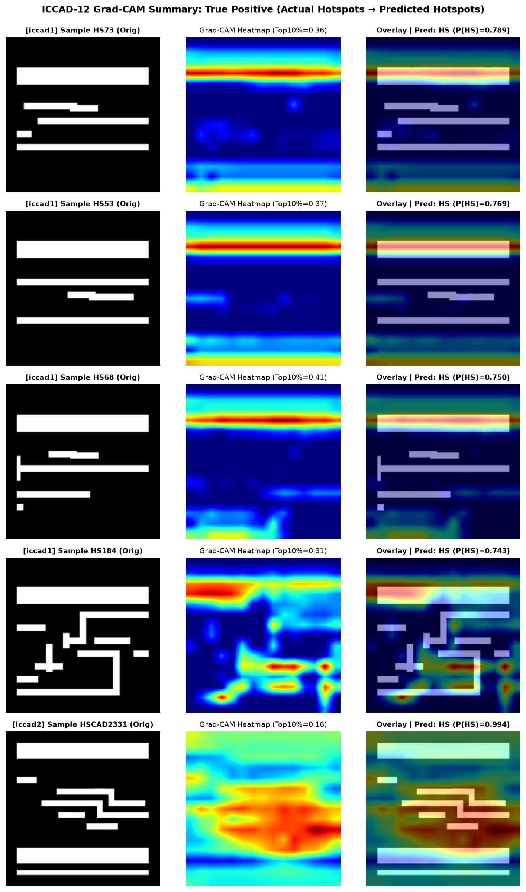
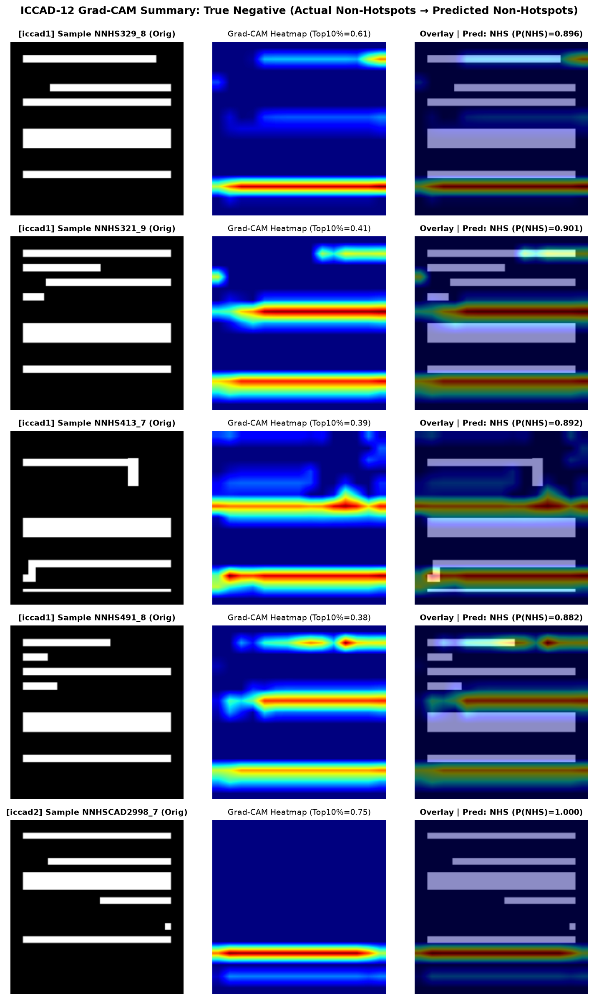
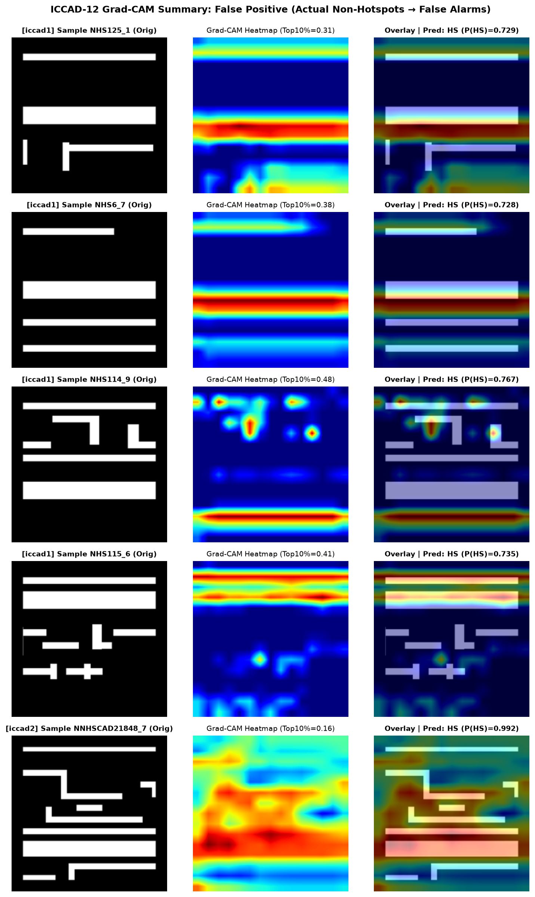
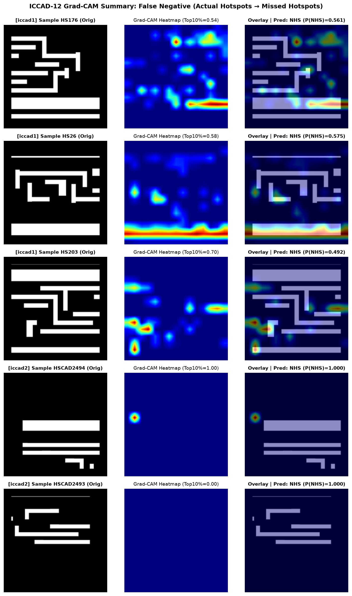

# Explainable Hotspot Detection in VLSI Lithography

[](https://www.python.org/)
[](https://www.tensorflow.org/)
[](https://developer.nvidia.com/cuda-toolkit)
[](https://opensource.org/licenses/MIT)

An Explainable AI (XAI) framework for **Lithography Hotspot Detection** across ICCAD-12 benchmarks 1–5, utilizing **Gradient-weighted Class Activation Mapping (Grad-CAM)** to localize and interpret spatial layout features driving Hotspot (HS) and Non-Hotspot (NHS) classifications.

---

## 🎯 Research Context & Objectives

- **Core Research Question**:  
  *Can explainable-AI techniques identify the layout regions or features that contribute most strongly to hotspot classification?*
- **Research Focus / Novelty**:  
  Applying spatial XAI attribution methods (such as **Grad-CAM**, with future extensions to occlusion analysis, saliency mapping, and feature attribution) to deep convolutional neural networks trained for VLSI layout printability verification.
- **Minimum Expected Investigation**:  
  Provide high-resolution visual explanations for representative **True Positive (HS)**, **True Negative (NHS)**, **False Positive (over-prediction)**, and **False Negative (missed defect)** test cases, and assess whether the highlighted spatial regions correspond to technically meaningful geometric structures (e.g., dense pitch lines, line-end pullback, pinching, and bridging risks).

---

## 🔬 Key Findings & Technical Highlights

1. **Pre-Sigmoid Logit Grad-CAM Formulation**:  
   Standard post-sigmoid gradient backpropagation causes severe gradient vanishing on high-confidence layout predictions ($p \approx 1.0$ or $p \approx 0.0$) due to derivative saturation $\sigma'(z) \to 0$. By formulating Grad-CAM w.r.t the **pre-sigmoid logit score** ($y^{\text{NHS}} = +z$, $y^{\text{HS}} = -z$), we obtain well-scaled, non-saturating attribution heatmaps across all benchmarks.
2. **Attribution Localization**:  
   - **True Positives (HS)**: Strongly focal activations centered on 2D pattern clusters, tight spacing margins, and critical line ends susceptible to Optical Proximity Effects (OPE).
   - **True Negatives (NHS)**: Dispersed attribution across regular, periodic Manhattan tracks.
   - **False Positives (FP)**: Over-attribution on complex layout jogs that mimic defect topologies despite passing DRC rules.
   - **False Negatives (FN)**: Misses occur primarily when sub-wavelength pinching flaws are smoothed out by coarse pooling stages in the deep network.

---

## 📊 Baseline CNN Performance (ICCAD-12)

The baseline model is a lightweight custom Sequential CNN (~12.8k parameters, 2 convolutional blocks with ELU activations, Batch Normalization, and Max Pooling) trained across ICCAD-12 benchmarks:

| Benchmark | Balanced Acc. | Precision | Recall (HS) | Specificity | F1 Score | Analyzed Grad-CAM Samples |
|:---|:---:|:---:|:---:|:---:|:---:|:---:|
| `iccad1` | **88.51%** | 0.1804 | 0.9867 | 0.7835 | 0.3051 | 15 samples |
| `iccad2` | **98.93%** | 0.5119 | 0.9900 | 0.9886 | 0.6749 | 16 samples |
| `iccad3` | **96.72%** | 0.4707 | 0.9773 | 0.9571 | 0.6354 | 16 samples |
| `iccad4` | **85.78%** | 0.6720 | 0.7175 | 0.9981 | 0.6940 | 16 samples |
| `iccad5` | **98.22%** | 0.1556 | 0.9756 | 0.9888 | 0.2685 | 13 samples |
| **Average** | **93.63%** | — | — | — | — | **76 samples** |

---

## 🖼️ Visual Explanation Gallery

### Category Summary Figures

| Category | Description | Visual Summary |
|:---|:---|:---:|
| **True Positive (TP)** | Actual Hotspot correctly identified with high confidence |  |
| **True Negative (TN)** | Actual Non-Hotspot correctly identified |  |
| **False Positive (FP)** | Non-Hotspot misclassified as Hotspot (false alarm) |  |
| **False Negative (FN)** | Hotspot misclassified as Non-Hotspot (missed defect) |  |

---

## 📁 Repository Structure

```text
├── models/                          # Trained Keras baseline checkpoints (iccad1..iccad5)
│   ├── custom_cnn_iccad1.keras
│   └── ...
├── src/
│   ├── data.py                      # Dataset loader and ImageDataGenerators
│   ├── model.py                     # Custom CNN architecture definition
│   ├── metrics.py                   # Balanced accuracy, confusion matrix, metrics
│   ├── train_baseline.py            # Baseline training and evaluation script
│   ├── gradcam.py                   # Reusable GradCAM engine & spatial statistics
│   └── run_gradcam.py               # Batch Grad-CAM extraction pipeline across ICCAD-12
├── results/
│   ├── baseline/                    # Baseline metrics JSON, confusion matrices, plots
│   └── gradcam/                     # Grad-CAM outputs (76 samples across iccad1..iccad5)
│       ├── gradcam_samples.csv      # Complete quantitative spatial metrics table
│       ├── GRADCAM_ANALYSIS.md      # Detailed sample-by-sample technical interpretation
│       ├── summary_TP.png           # Multi-sample comparison grid for TP
│       ├── summary_TN.png           # Multi-sample comparison grid for TN
│       ├── summary_FP.png           # Multi-sample comparison grid for FP
│       ├── summary_FN.png           # Multi-sample comparison grid for FN
│       ├── iccad1/                  # Individual original, heatmap, overlay, & comparison panels
│       ├── iccad2/
│       ├── iccad3/
│       ├── iccad4/
│       └── iccad5/
├── docs/
│   └── GRADCAM.md                   # Full Grad-CAM methodology and mathematical formulation
├── scripts/
│   └── tf_gpu.sh                    # Environment launcher with CUDA/cuDNN support
├── BASELINE.md                      # Baseline reproduction notes and environment specs
└── requirements.txt                 # Python dependencies
```

---

## 🚀 Getting Started

### 1. Environment Setup

```bash
# Clone the repository
git clone git@github.com:Sohan-Chitluri/Explainable-Hotspot-Detection.git
cd Explainable-Hotspot-Detection

# Create virtual environment and install dependencies
python3.11 -m venv .venv
source .venv/bin/activate
pip install -r requirements.txt
```

### 2. Dataset Setup

Download `iccad_official.rar` from the [ICCAD-12 Google Drive Link](https://drive.google.com/file/d/1jx7gDR92sqoIw2Nh4NGwwZwC-qNp2osd/view?usp=share_link) and extract it into `iccad-official/`:

```text
iccad-official/
  iccad1/ (train/test)
  iccad2/ (train/test)
  iccad3/ (train/test)
  iccad4/ (train/test)
  iccad5/ (train/test)
```

### 3. Reproducing Grad-CAM Visual Explanations

Execute the full Grad-CAM extraction across all 5 ICCAD benchmarks using GPU acceleration:

```bash
# GPU Execution (NixOS / CUDA 12.2 wrapper)
bash scripts/tf_gpu.sh -m src.run_gradcam

# Standard Python execution
python -m src.run_gradcam --benchmarks 1 2 3 4 5 --samples-per-case 4
```

### 4. Running Custom Single-Image Grad-CAM

```python
from src.gradcam import GradCAM, save_comparison_panel

# Load model and initialize Grad-CAM targeting conv2d_5
gc = GradCAM.from_checkpoint("models/custom_cnn_iccad1.keras", target_layer_name="conv2d_5")

# Explain a test layout
result = gc.explain_image("iccad-official/iccad1/test/test_hs/HS73.png", target_class="HS")

print("Prediction:", result["pred_label"], "P(HS):", result["p_hs"])
print("Activation Center of Mass:", result["centroid_x"], result["centroid_y"])
print("Top-10% Activation Concentration:", result["top10_activation_fraction"])

# Save 3-panel figure: Original | Heatmap | Overlay
save_comparison_panel(
    result["raw_rgb"],
    result["heatmap_224"],
    result["overlay"],
    "output_comparison.png",
    title="ICCAD-1 HS Sample 73"
)
```

---

## 📖 Citation & References

- Selvaraju, R. R., et al. (2017). *Grad-CAM: Visual Explanations from Deep Networks via Gradient-Based Localization*. ICCV 2017.
- ICCAD-12 CAD Contest on Lithography Hotspot Detection: Benchmark Dataset.
- Original Baseline Codebase: [Intelectron6/Lithography-Hotspot-Detection](https://github.com/Intelectron6/Lithography-Hotspot-Detection).
