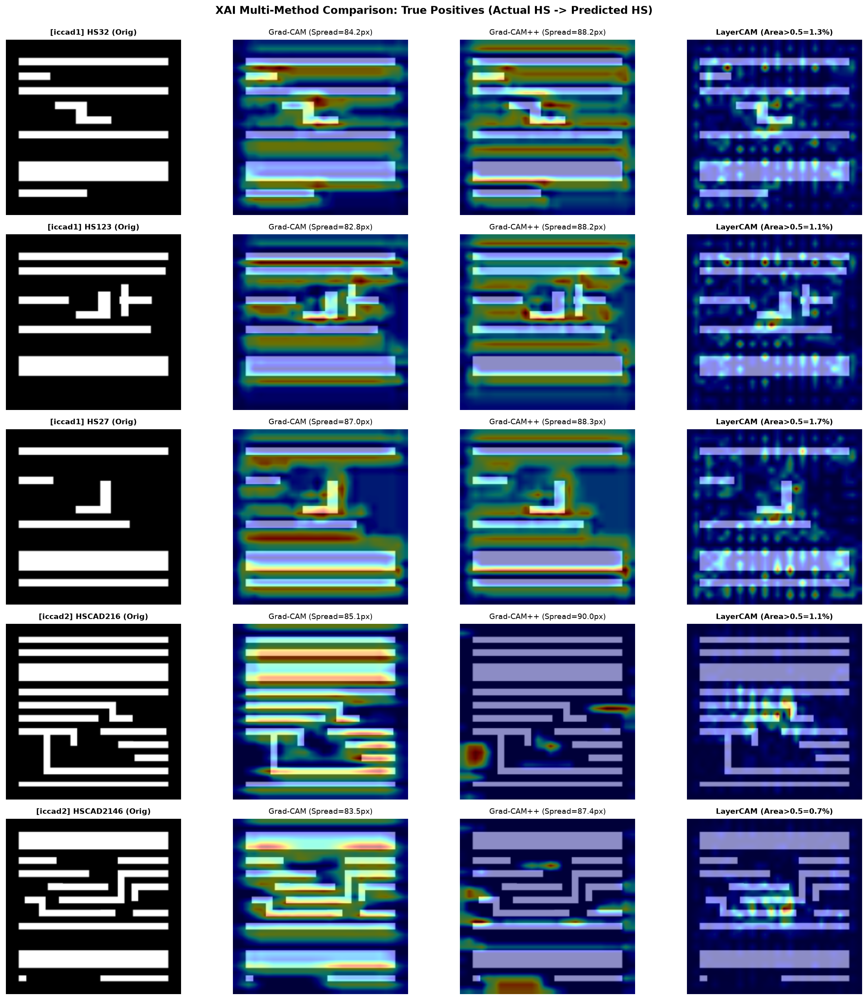
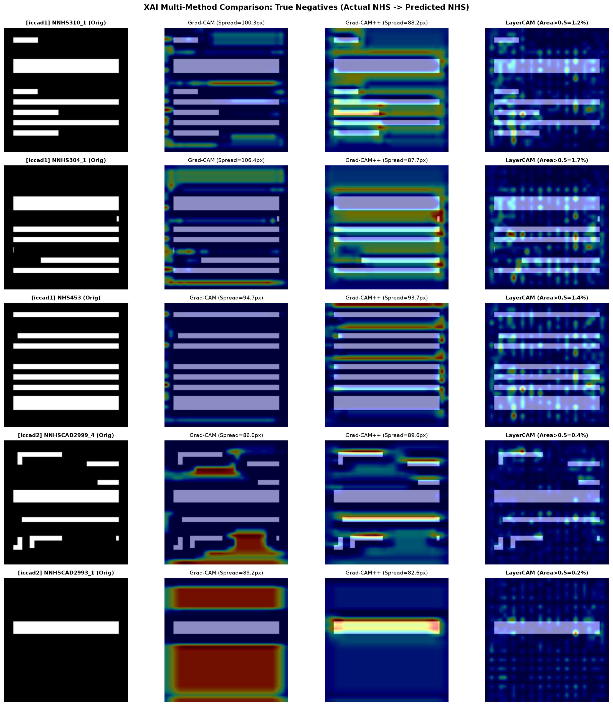
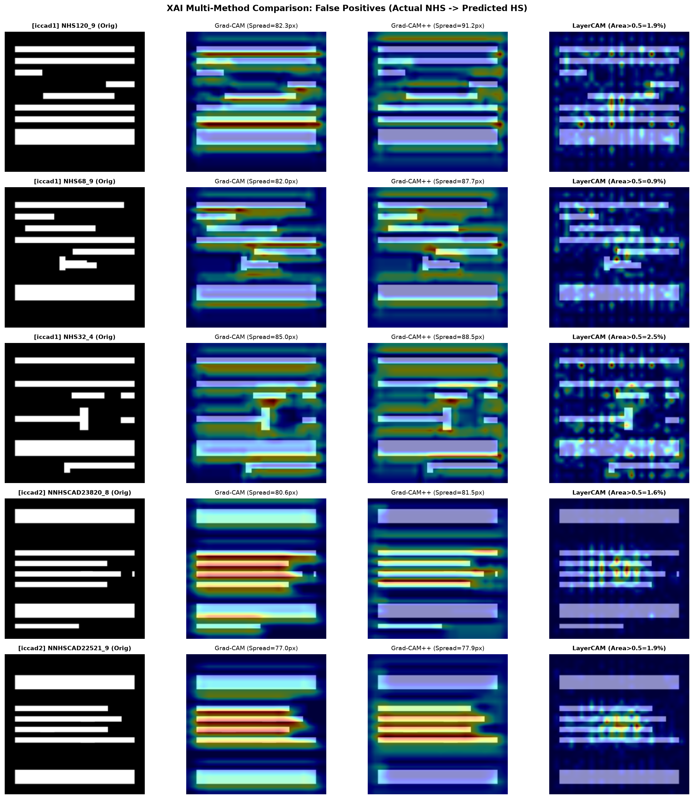
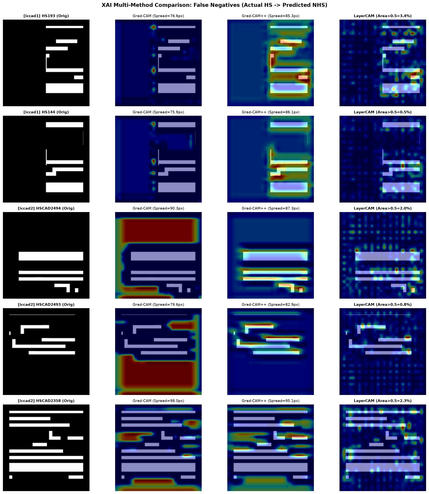

# Explainable Hotspot Detection in VLSI Lithography

[](https://www.python.org/)
[](https://www.tensorflow.org/)
[](https://developer.nvidia.com/cuda-toolkit)
[](https://opensource.org/licenses/MIT)

An end-to-end Explainable Artificial Intelligence (XAI) framework for **Lithography Hotspot Detection** across ICCAD-12 benchmarks 1–5. This repository couples high-resolution convolutional neural architectures with multi-method visual and quantitative attribution techniques—including **Vanilla Grad-CAM**, **Grad-CAM++**, and **LayerCAM** across multi-layer resolution hierarchies.

---

## 🎯 Research Context & Objectives

- **Core Research Question**:  
  *Can explainable AI techniques localize the critical spatial layout topologies (sub-wavelength pitch pinching, line-end pullbacks, corner rounding, and dense 2D patterns) driving hotspot classifications in deep neural networks?*
- **Explainability Suite**:  
  1. **Vanilla Grad-CAM** (Global Average Pooled gradient weighting)
  2. **Grad-CAM++** (Pixel-weighted higher-order derivatives for multi-instance localization)
  3. **LayerCAM** (Fine-grained pixel-wise gradient activation preserving layout edges)
  4. **Multi-Layer Resolution Hierarchy** (LayerCAM evaluated at Early $112\times 112$, Intermediate $56\times 56$, and Final $28\times 28$ convolutional representations)
- **Quantitative Spatial Diagnostics**:  
  Attribution center-of-mass centroids, spatial spread radii, high-activation area fractions ($>0.25, >0.50, >0.75$), connected component counts, and outer perimeter boundary concentration.

---

## 🔬 Key Technical Innovations

1. **Pre-Sigmoid Logit Formulation**:  
   Standard post-sigmoid backpropagation suffers from severe gradient vanishing on high-confidence layout predictions ($p \approx 1.0$ or $p \approx 0.0$) due to derivative saturation $\sigma'(z) \to 0$. Formulating attribution gradients with respect to the **pre-sigmoid logit score** ($y^{\text{NHS}} = +z$, $y^{\text{HS}} = -z$) preserves high gradient signal fidelity across all confidence regimes.
2. **XAI-Ready Architecture (`model_xai.py`)**:  
   Unlike baseline models that collapse layout features to an overly coarse $15\times 15$ activation grid via aggressive pooling and valid padding, the XAI-Ready CNN uses `'same'` padding and modular $2\times 2$ pooling stages to maintain a rich **$28\times 28$ final convolutional feature map** with 128k parameters.
3. **Multi-Target Comparative Attribution**:  
   Both predicted-class (`pred_*`) and ground-truth-class (`true_*`) heatmaps and overlays are generated to inspect *why* false positives and false negatives occur.

---

## 📊 Benchmark Model Performance (ICCAD-12)

Comparison between the Baseline CNN and the XAI-Ready CNN across test sets:

| Benchmark | Test Images | XAI Balanced Acc. | Baseline Balanced Acc. | XAI Recall (HS) | XAI Specificity | XAI F1 Score | XAI Inference Latency |
|:---|:---:|:---:|:---:|:---:|:---:|:---:|:---:|
| **iccad1** | 4,905 | **89.35%** | 88.51% | **99.12%** | 79.59% | 0.3189 | 4.01 ms |
| **iccad2** | 41,796 | **93.14%** | 98.93% | 86.75% | **99.54%** | **0.7714** | 3.96 ms |
| **iccad3** | 48,141 | **96.41%** | 96.72% | 97.07% | 95.74% | 0.6340 | 3.99 ms |
| **iccad4** | 32,067 | **94.30%** | 85.78% | **91.53%** | 97.08% | 0.2549 | 4.07 ms |
| **iccad5** | 19,368 | **95.01%** | 98.22% | **97.56%** | 92.47% | 0.0520 | 4.03 ms |
| **Average** | **146,277** | **93.64%** | 93.63% | **94.41%** | **92.88%** | **0.4062** | **4.01 ms** |

---

## 🖼️ Visual Explanation Gallery

Multi-method comparison sheets for representative True Positive (TP), True Negative (TN), False Positive (FP), and False Negative (FN) test samples:

| Confusion Category | Description | Visual Summary (Original \| Grad-CAM \| Grad-CAM++ \| LayerCAM) |
|:---|:---|:---:|
| **True Positive (TP)** | Hotspot correctly detected with high confidence |  |
| **True Negative (TN)** | Regular non-hotspot pattern correctly classified |  |
| **False Positive (FP)** | Complex non-hotspot geometry flagged as false alarm |  |
| **False Negative (FN)** | Subtle hotspot defect missed by classifier |  |

---

## 📁 Repository Structure

```text
├── models/
│   ├── custom_cnn_iccad1..5.keras    # Baseline model checkpoints
│   └── xai/
│       └── xai_cnn_iccad1..5.keras   # Trained XAI-Ready CNN checkpoints (28x28 conv)
├── src/
│   ├── data.py                       # Dataset loader and ImageDataGenerators
│   ├── model.py                      # Baseline CNN architecture (15x15 final conv)
│   ├── model_xai.py                  # XAI-Ready CNN architecture (28x28 final conv)
│   ├── metrics.py                    # Balanced accuracy, confusion matrix, metric reporting
│   ├── train_baseline.py             # Baseline training and evaluation script
│   ├── train_xai.py                  # XAI-Ready CNN training with class-balancing
│   ├── gradcam.py                    # Standalone baseline Grad-CAM engine
│   ├── run_gradcam.py                # Batch baseline Grad-CAM extraction
│   ├── xai_engine.py                 # Multi-method XAI suite (Grad-CAM, Grad-CAM++, LayerCAM)
│   ├── xai_diagnostics.py            # Quantitative spatial attribution diagnostics
│   └── run_xai.py                    # Full XAI explanation and summary pipeline
├── results/
│   ├── baseline/                     # Baseline evaluation results & training logs
│   ├── xai_training/                 # XAI model training logs & comparison metrics
│   ├── gradcam/                      # Baseline Grad-CAM results (76 samples)
│   └── xai/                          # Full Multi-Method XAI results (57 representative samples)
│       ├── xai_diagnostics.csv       # Quantitative spatial metrics table (33 columns)
│       ├── summary_TP.png            # Multi-method comparison sheet for TP
│       ├── summary_TN.png            # Multi-method comparison sheet for TN
│       ├── summary_FP.png            # Multi-method comparison sheet for FP
│       ├── summary_FN.png            # Multi-method comparison sheet for FN
│       ├── iccad1/                   # Per-sample folders with 15 explanation artifacts each
│       ├── iccad2/
│       ├── iccad3/
│       ├── iccad4/
│       └── iccad5/
├── docs/
│   ├── GRADCAM.md                    # Baseline Grad-CAM mathematical formulation
│   ├── XAI_MODEL_AUDIT.md            # Phase 1: Baseline & Model Architecture Audit Report
│   └── XAI_PIPELINE_AUDIT.md         # Comprehensive XAI Pipeline & Concurrency Audit Report
├── scripts/
│   └── tf_gpu.sh                     # GPU environment launcher for CUDA/cuDNN on NixOS
├── requirements.txt                  # Python dependencies
└── README.md
```

---

## 🚀 Getting Started

### 1. Environment Setup

```bash
# Clone repository
git clone git@github.com:Sohan-Chitluri/Explainable-Hotspot-Detection.git
cd Explainable-Hotspot-Detection

# Create virtual environment and install dependencies
python3.11 -m venv .venv
source .venv/bin/activate
pip install -r requirements.txt
```

### 2. Dataset Setup

Download `iccad_official.rar` from the [ICCAD-12 Google Drive Link](https://drive.google.com/file/d/1jx7gDR92sqoIw2Nh4NGwwZwC-qNp2osd/view?usp=share_link) and extract it into `iccad-official/`:

```text
iccad-official/
  iccad1/ (train/test)
  iccad2/ (train/test)
  iccad3/ (train/test)
  iccad4/ (train/test)
  iccad5/ (train/test)
```

### 3. Training the XAI-Ready CNN

```bash
# GPU Execution (via CUDA launcher)
bash scripts/tf_gpu.sh -m src.train_xai --benchmarks 1 2 3 4 5

# Direct Python Execution
python -m src.train_xai --benchmarks 1 2 3 4 5 --batch-size 32
```

### 4. Running the Multi-Method XAI Pipeline

```bash
# GPU Execution (via CUDA launcher)
bash scripts/tf_gpu.sh -m src.run_xai

# Direct Python Execution
python -m src.run_xai --benchmarks 1 2 3 4 5 --samples-per-case 3 --alpha 0.45
```

### 5. Python API Usage

```python
from src.xai_engine import XAIEngine
from src.xai_diagnostics import compute_attribution_diagnostics

# Load model checkpoint
engine = XAIEngine.from_checkpoint("models/xai/xai_cnn_iccad1.keras", target_layer_name="conv_final_2")

# Preprocess input layout image
img_tensor, raw_rgb = engine.preprocess_image("iccad-official/iccad1/test/test_hs/HS73.png")

# 1. Vanilla Grad-CAM
_, gcam_heatmap, gcam_info = engine.explain_gradcam(img_tensor, target_class="HS")

# 2. Grad-CAM++
_, gcam_pp_heatmap, _ = engine.explain_gradcam_plus_plus(img_tensor, target_class="HS")

# 3. LayerCAM
_, layercam_heatmap, _ = engine.explain_layercam(img_tensor, target_class="HS")

# 4. Quantitative Spatial Diagnostics
diagnostics = compute_attribution_diagnostics(layercam_heatmap)
print(f"LayerCAM Centroid: ({diagnostics['centroid_x']}, {diagnostics['centroid_y']})")
print(f"Spatial Spread Radius: {diagnostics['spatial_spread_radius']} px")
print(f"Fraction of Area > 0.5: {diagnostics['fraction_above_050'] * 100:.1f}%")
```

---

## 📑 Technical Documentation & Audit Reports

- [docs/XAI_PIPELINE_AUDIT.md](docs/XAI_PIPELINE_AUDIT.md): In-depth audit report analyzing test-set coverage (146,277 images), 57-row CSV explanation, task-123 vs task-127 concurrency forensics, method verification, and provenance.
- [docs/XAI_MODEL_AUDIT.md](docs/XAI_MODEL_AUDIT.md): Baseline model architecture audit, receptive field limitations, and XAI-Ready CNN design rationale.
- [docs/GRADCAM.md](docs/GRADCAM.md): Detailed mathematical formulations for Grad-CAM pre-sigmoid backpropagation and spatial metrics.

---

## 📖 Citation & References

- Selvaraju, R. R., et al. (2017). *Grad-CAM: Visual Explanations from Deep Networks via Gradient-Based Localization*. ICCV 2017.
- Chattopadhay, A., et al. (2018). *Grad-CAM++: Generalized Gradient-Based Visual Explanations for Deep Convolutional Networks*. WACV 2018.
- Jiang, P.-T., et al. (2021). *LayerCAM: Exploring Hierarchical Class Activation Maps for Localization*. IEEE TIP 2021.
- ICCAD-12 CAD Contest on Lithography Hotspot Detection: Benchmark Dataset.
